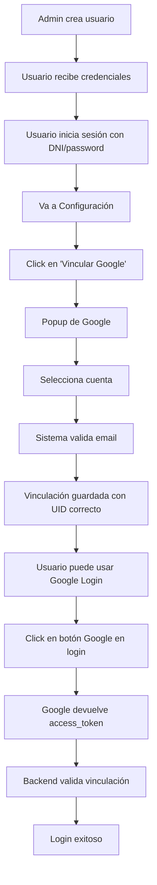

# Solución al problema de inicio de sesión con Google OAuth

## 📋 Resumen del problema

El sistema tenía un **conflicto en el formato del UID** de las cuentas de Google:
- Cuando se vinculaba desde el flujo web (`/social/login/google-oauth2/`), el UID se guardaba como **email**
- Cuando se intentaba iniciar sesión con el botón de Google, se usaba el **ID numérico** de Google
- Esto causaba que el sistema no reconociera la cuenta como vinculada (error 400)

## ✅ Cambios implementados

### 1. **Backend - Pipeline de autenticación** (`apps/user/pipeline.py`)

Se reemplazó el pipeline de creación de usuarios por uno que:
- **NO crea usuarios nuevos** (solo el admin puede crear cuentas)
- Valida que el usuario exista y esté vinculado antes de permitir el login
- Muestra mensajes de error claros cuando falta la vinculación

```python
def require_existing_user(strategy, details, backend, user=None, *args, **kwargs):
    """
    Solo permite login si el usuario ya existe y está vinculado.
    NO crea usuarios nuevos.
    """
```

### 2. **Backend - Endpoint de vinculación** (`apps/user/views.py`)

Se creó un nuevo endpoint `/api/user/link-google/` que:
- Usa el mismo flujo que el login (access_token de Google)
- Garantiza que el UID se guarde correctamente como ID numérico
- Valida que el email de Google coincida con el email del usuario
- Permite actualizar vinculaciones incorrectas

### 3. **Frontend - Componentes de configuración**

Se actualizaron ambos componentes:
- `ConfiguracionAdmin.jsx`
- `ConfiguracionUsuario.jsx`

Ahora usan `useGoogleLogin` de `@react-oauth/google` en lugar del flujo web tradicional, garantizando consistencia con el login.

### 4. **Configuración** (`core/settings.py`)

Se actualizó el pipeline para:
```python
SOCIAL_AUTH_PIPELINE = (
    'social_core.pipeline.social_auth.social_details',
    'social_core.pipeline.social_auth.social_uid',
    'social_core.pipeline.social_auth.auth_allowed',
    'social_core.pipeline.social_auth.social_user',
    'social_core.pipeline.social_auth.associate_by_email',
    'apps.user.pipeline.require_existing_user',  # ← Solo usuarios existentes
    'social_core.pipeline.social_auth.associate_user',
    'social_core.pipeline.social_auth.load_extra_data',
    'social_core.pipeline.user.user_details',
    'apps.user.pipeline.save_profile_details',
)
```

## 🔧 Acciones realizadas

1. ✅ Eliminada la vinculación incorrecta del usuario 44464273
2. ✅ Actualizado el pipeline de autenticación
3. ✅ Creado nuevo endpoint de vinculación
4. ✅ Actualizados los componentes del frontend
5. ✅ Creado script de diagnóstico (`fix_google_uid.py`)

## 📝 Instrucciones para el usuario (DNI: 44464273)

### Para volver a vincular tu cuenta de Google:

1. **Inicia sesión con tus credenciales normales** (DNI y contraseña)

2. **Ve al panel de configuración**:
   - Para admin: `/panel/admin/configuracion`
   - Para nutricionista: `/panel/nutri/configuracion`
   - (La ruta de login es `/login` para todos los roles)

3. **Haz clic en "Vincular cuenta de Google"**
   - Ahora se abrirá un popup de Google (en lugar de redirigir)
   - Selecciona tu cuenta de Google
   - La vinculación se realizará correctamente

4. **Verifica la vinculación**:
   - Deberías ver "Conectado como: benjaminbenitez55@gmail.com"

5. **Prueba el inicio de sesión**:
   - Cierra sesión
   - Ve a `/login` (ruta compartida para todos los roles)
   - Haz clic en "Iniciar sesión con Google"
   - Deberías poder ingresar sin problemas

## 🔍 Verificación del sistema

Para verificar que todo funciona correctamente:

```bash
# Verificar configuración
python manage.py check

# Ver cuentas vinculadas
python manage.py shell -c "from social_django.models import UserSocialAuth; [print(f'{s.user.dni}: {s.provider} - UID: {s.uid}') for s in UserSocialAuth.objects.all()]"

# Ejecutar script de diagnóstico
python fix_google_uid.py
```

## 🚀 Cómo reiniciar el servidor

Si el servidor de Django está corriendo, necesitas reiniciarlo para aplicar los cambios:

```bash
# Detener el servidor actual (Ctrl+C en la terminal donde está corriendo)

# Iniciar nuevamente
python manage.py runserver
```

Si también tienes el frontend corriendo con Vite, no necesitas reiniciarlo (se actualizará automáticamente).

## 🐛 Solución de problemas

### Error: "Esta cuenta de Google no está vinculada"
**Solución**: Ve al panel de configuración y vincula tu cuenta de Google.

### Error: "El correo de Google no coincide con el correo de tu cuenta"
**Solución**: Asegúrate de vincular la misma cuenta de Google que tiene tu email registrado.

### Error: "No existe un usuario con este correo electrónico"
**Solución**: Contacta al administrador para que cree tu cuenta primero.

### La cuenta aparece vinculada pero no puedo iniciar sesión
**Solución**: 
1. Desvincula la cuenta desde el panel de configuración
2. Vuelve a vincularla usando el nuevo flujo
3. Verifica que el UID sea un número, no un email:
   ```bash
   python fix_google_uid.py
   ```

## 📊 Flujo completo del sistema



## 🎯 Endpoints importantes

| Endpoint | Método | Descripción |
|----------|--------|-------------|
| `/auth/o/google-oauth2/` | POST | Login con Google (Djoser) |
| `/api/user/link-google/` | POST | Vincular cuenta de Google |
| `/api/user/disconnect/google-oauth2/` | POST | Desvincular cuenta de Google |
| `/auth/users/me/` | GET | Obtener datos del usuario actual |

## 📚 Archivos modificados

- ✏️ `apps/user/pipeline.py` - Pipeline de autenticación
- ✏️ `apps/user/views.py` - Nuevas vistas de vinculación
- ✏️ `apps/user/urls.py` - Nuevas rutas
- ✏️ `apps/user/models.py` - Soporte para usuarios sin password
- ✏️ `core/settings.py` - Configuración del pipeline
- ✏️ `src/components/EditPerfil/ConfiguracionAdmin.jsx` - UI de vinculación
- ✏️ `src/components/EditPerfil/ConfiguracionUsuario.jsx` - UI de vinculación
- ➕ `fix_google_uid.py` - Script de diagnóstico

## 🔐 Seguridad

El sistema ahora:
- ✅ NO permite crear cuentas desde Google OAuth
- ✅ Solo permite login si la cuenta está previamente vinculada
- ✅ Valida que el email de Google coincida con el del usuario
- ✅ Protege el campo DNI de actualizaciones desde OAuth
- ✅ Usa UIDs correctos (ID numérico de Google, no email)

---

**Fecha de implementación**: 19 de Octubre, 2025
**Versión**: v5-autenticacion-modelos-fix
